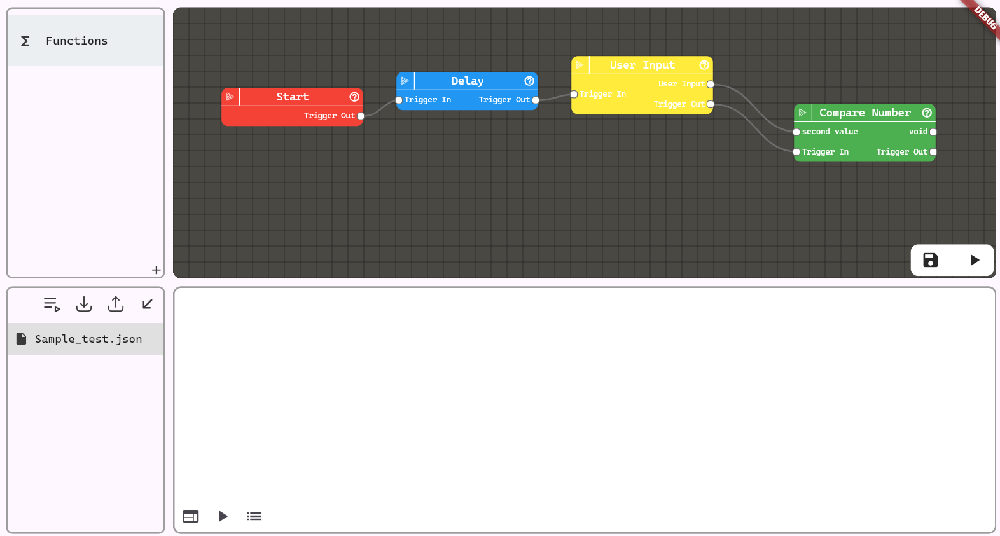

# Autty

A Fairly simple automation tool to automate repetative tasks on multiple levels. It can execute methods over WebSocketRPC or local PC, or even any device on LAN. That may be another computer, or even an ESP32

## Getting Started

1. Import the project in Flutter
2. Run "dart run sqflite_common_ffi_web:setup"
3. Run the main.dart file. 

TODO:
- implement: make status colors on files and message type colors be vertical pill shaped color dots
- implement: detection of weird loops and impossible connections
- implement: predefined value node (with just outport)

- fix: overflow in manual device add menu on some screens

- implement: device list svg icon
- implement: delete playground warning
- implement: load playground gives a hint to save unless the playground is empty
- implement: ctrl/shift selection on playground files (delete, run)